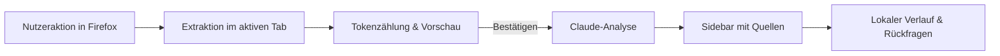

<p align="center">
  
</p>

<h1 align="center">Diskussionsanalyse</h1>

<p align="center">
  Artikel und Kommentare in Firefox verstehen: mit Quellen, sichtbarer Abdeckung und einer Kostenvorschau vor jeder Claude-Analyse.
</p>

<p align="center">
  <a href="https://github.com/Padrio/diskussionsanalyse/actions/workflows/ci.yml"></a>
  
  <a href="LICENSE"></a>
</p>

Diskussionsanalyse ist eine quelloffene Firefox-Erweiterung. Sie liest den aktuellen Beitrag und erreichbare Kommentare, zeigt vor dem Start den Umfang und geschätzte Tokenkosten an und streamt anschließend eine deutschsprachige Analyse in die Sidebar. Der Abschnitt **Bias & Tendenz** beschreibt die Schlagseite des vorliegenden Materials und macht Grenzen der Stichprobe sichtbar.

> Ein eigener Anthropic-API-Key ist erforderlich. Dieses Projekt ist unabhängig von Anthropic und Mozilla.

## Was die Erweiterung zeigt

| Funktion | Details |
| --- | --- |
| **Vorschau vor jeder Analyse** | Erfasste und ausgewählte Kommentare, Plattformgesamtzahl soweit verlässlich verfügbar, Input-Tokens, Output-Szenarien und Kostenbereich. Auch Rückfragen werden bestätigt. |
| **Kommentarabdeckung** | Bei langem Input bleiben verschiedene Gesprächsfäden und Autoren vertreten. Gekürzte Artikel und Kommentare werden kenntlich gemacht. |
| **Nachprüfbare Aussagen** | Kommentare erhalten IDs wie `[C12]`. Wenn ein verlässlicher Direktlink existiert, ist der Beleg anklickbar; Auszüge stehen im Quellenbereich. |
| **Analyse & Rückfragen** | Fünf gut lesbare Abschnitte, Live-Streaming, Folgefragen mit Kontext, Kopieren und Markdown-Export. |
| **Lokaler Verlauf** | Analysen, Teilresultate und tatsächliche Token-Nutzung bleiben im Browser erhalten. Erneutes Öffnen der Sidebar startet keinen bezahlten Request. |

Spezielle Extraktoren gibt es für **Hacker News** und **YouTube**. Andere Seiten laufen über Readability und eine Kommentar-Heuristik. Die Erfassung ist auf dynamischen Seiten möglicherweise unvollständig; eine unbekannte Plattformgesamtzahl wird deshalb auch als **unbekannt** angezeigt.

## Schnellstart

**Voraussetzungen:** Firefox 128 oder neuer, Node.js 20 oder neuer und ein eigener Anthropic-API-Key.

```bash
git clone https://github.com/Padrio/diskussionsanalyse.git
cd diskussionsanalyse
npm ci
npm run build
```

1. In Firefox `about:debugging#/runtime/this-firefox` öffnen, **Temporäres Add-on laden** wählen und `dist/manifest.json` auswählen.
2. In den Erweiterungseinstellungen den API-Key hinterlegen und ein verfügbares Claude-Modell wählen.
3. Auf einer Seite das **Analyse-Icon** anklicken, **Diskussion analysieren** im Kontextmenü wählen oder `Strg+Shift+Y` drücken.
4. Kommentarumfang und Kosten in der Sidebar prüfen und **Analysieren** wählen. Rückfragen zeigen erneut eine Vorschau.

Der separate Sidebar-Umschalter öffnet nur die Sidebar; die Extraktion braucht eine der genannten Nutzeraktionen. Temporär geladene Add-ons verschwinden nach einem Firefox-Neustart. Ein signiertes AMO-Paket ist derzeit nicht veröffentlicht.

## Datenfluss und Datenschutz



**Die Tokenzählung über Anthropic sendet Seiteninhalt bereits vor der Bestätigung der Analyse an die Anthropic-API.** Nach der Bestätigung wird der vorbereitete Inhalt für die Analyse erneut gesendet. Scheitert die Tokenzählung vorübergehend, zeigt die Erweiterung eine gekennzeichnete lokale Schätzung und verlangt eine ausdrückliche Bestätigung.

Der API-Key liegt in `browser.storage.local`; dieser Speicher ist von der Erweiterung isoliert, aber nicht zusätzlich durch das Betriebssystem verschlüsselt. Der Analyseverlauf liegt lokal in IndexedDB. Es gibt keinen eigenen Server. Bitte keine API-Keys in Issues, Screenshots oder Testdateien veröffentlichen.

Kosten und Output-Tokens sind **Schätzungen**, keine Abrechnungsgarantie. Der Output kann auch Thinking-Tokens enthalten. Claude kann Aussagen fehlinterpretieren; Quellenlinks und Auszüge helfen beim Gegenprüfen.

## Entwicklung

```bash
npm run dev          # Vite-Entwicklungsmodus
npm test             # Unit-Tests
npx tsc --noEmit     # TypeScript-Prüfung
npm run build        # Firefox-Bundle nach dist/
npm run lint:ext     # web-ext-Prüfung des Bundles
npm run start:ff     # gebautes Add-on in einem Test-Firefox starten
```

Die CI führt Installation, Typprüfung, Tests, Build und Extension-Lint aus. Architektur und Beitragshinweise stehen in [CONTRIBUTING.md](CONTRIBUTING.md). Der [ursprüngliche Projektentwurf](docs/initial-concept.md) und eine [frühe Verifikation](docs/initial-verification.md) sind historische Dokumente; für den aktuellen Stand gelten Code und README.

## Grenzen und nächste Schritte

- YouTube-Kommentare werden nur innerhalb der technisch erreichbaren Seiten und gesetzten Extraktionsgrenzen erfasst. Der generische Extraktor kann Kommentarbereiche übersehen.
- Die Analyse beschreibt das **vorliegende Material**. Eine Auswahl sichtbarer Kommentare belegt keine Mehrheit auf der Plattform oder in der Bevölkerung.
- Ein dauerhaft installierbares Firefox-Release, eigene Reddit-/X-Extraktoren und ein Chrome-Port stehen noch aus.

## Lizenz

Apache License 2.0 – siehe [LICENSE](LICENSE).
